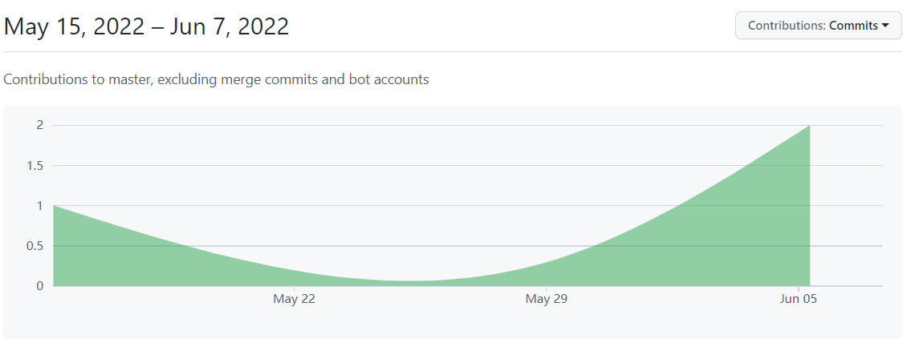
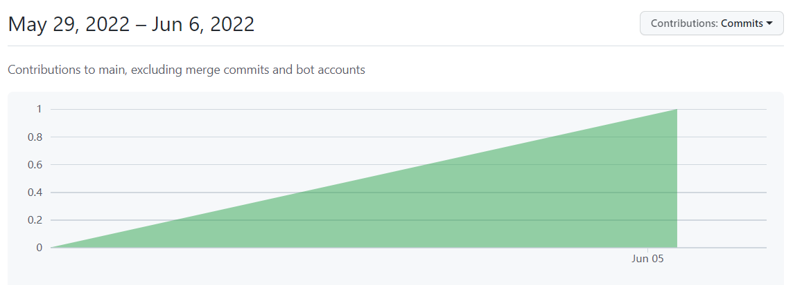

# 2021-2022学年第2学期
# **实 验 报 告**


- 课程名称:跨平台脚本开发技术  
- 实验项目:  期末大作业
- 专业班级：<u>计算机1904</u>                      
- 学生学号：<u>31901124</u>
- 学生姓名：<u>郑瑞焓</u>
- 实验指导教师:郭鸣

## 实验内容


1. 项目分工表格
    
    | 姓名 |学号 |班级 |任务|权重|
    |:-:|:--:|:-:|:-:|:-:|
| 郑瑞焓 | 31901124 | 计算机1904 | 实现用户用户名、用户签名的修改，用户头像的上传和更新 | 1.0 |
    
    
    
    
    
1. 项目自我评估表

     

    | 技术点          | 自评等级:(1-5) | 备注 |
    |:-:|:--:|:-:|
    | 响应式编程      |3| 本项目的前端部分数据采取了响应式，在前端数据更新时会将更新的结果同步显示在前端 |
    | 函数式编程      |3| 函数式编程是一种比较常见的编程方式，本项目中使用的JS是很常见的一种使用函数时编程的语言 |
    | Express框架  |4| 使用Express框架来作为后端搭建的基础 |
    | multer  |2| 使用multer插件来辅助实现图片的传输与保存 |
    
1. 项目说明

    1. 项目是独立开发

        本项目是由前端VUE以及后端的Node.js。后端方面，我采取Express框架作为本次项目的搭建基础，使用Mysql2来连接数据库，Sequelize来实现后端和数据库之间的数据传输。前端方面，我和移动应用交互设计课程的作业相联系，使用vue，vant和js脚本来实现数据的展示。

        - 个人资料修改

            ```js
            axios.post('http://localhost:3000/api/user/upload', formData, {
                    headers: {
                      'enctype': 'multipart/form-data'
                    }
                  }).then(res => {
                    console.log(res.data)
                    let user = {
                      username: userInfo.username
                    }
                    axios({
                      method: 'get',
                      url: 'http://localhost:3000/api/user/find',
                      params: user
                    }).then(res => {
                      console.log(res.data)
                      userInfo.imgUrl = res.data[0].avaUrl
                      store.state.userInfo.imgUrl = res.data[0].avaUrl
                    })
                  })
            ```

            ```js
            exports.find = (req, res) => {
                if (!req.params.username) {
                    res.status(400).send({
                        message: '用户名不能为空！'
                    })
                    return;
                }
            
                User.findAll({
                    where: {
                        userName: req.query.username
                    }
                }).then(data => {
                    res.send(data)
                }).catch(err => {
                    res.status(500).send({
                        message:
                            err.message || "新建用户出错"
                    })
                })
            }
            ```

            

        - 用户头像修改

            ```js
            exports.editUserImg = (req, res) => {
                const file = req.file
            
                console.log(path.parse(req.file.originalname).ext);
                let oldname = req.file.path //获取path
                let newname = req.file.path + path.parse(req.file.originalname).ext
                fs.renameSync(oldname, newname) //重命名
                console.log('文件类型：%s', file.mimetype)
                console.log('原始文件名：%s', file.originalname)
                console.log('文件大小：%s', file.size)
                console.log('文件保存路径：%s', file.path)
            
                User.update(
                    {
                        avaUrl:'http://localhost:3000/'+file.filename+path.parse(req.file.originalname).ext//修改数据库
                    },
                    {
                        where:{
                            userName:req.body.username
                        }
                    }).then((data)=>{
                        res.send(data);
                    })
            }
            ```

            后端使用中间件multer来接受前端传输过来的图片，并且将其文件名随机化处理后保存在对应的upload目录下，同时读取随机化后的文件名称并将存储的路径地址保存在数据库中。

1. 技术要点解决说明

    - ./config/db.config.js连接数据库所需要的各类参数

        ```js
        module.exports={
            HOST: "localhost",
            USER: "root",
            PASSWORD: "123456",
            DB: "assignment",
            dialect: 'mysql',
        }
        ```

        ```js
        const dbConfig = require("../config/db.config");
        const Sequelize = require('sequelize')
        
        module.exports=(sequelize, Sequelize)=>{
            return sequelize.define("user", {
                userName: {
                    type: Sequelize.STRING
                },
                password: {
                  type: Sequelize.STRING
                },
                nickName: {
                    type: Sequelize.STRING
                },
                sign: {
                    type: Sequelize.STRING
                },
                avaUrl: {
                    type: Sequelize.STRING
                }
            })
        }
        
        ```

    - 用户数据类型建立模型，方便数据传递

        ```js
        const multer = require('multer')
        const upload = multer({ dest: 'upload/' })
        
        module.exports = app => {
            const user = require('../controllers/user.controller.js')
            const router = require('express').Router();
        
            router.post("/", user.create);
            router.post("/updateNickName",user.updateNickName)
            router.get("/find", user.find);
        
            router.post("/upload", upload.single('avatar'),user.editUserImg)
        
        
            app.use('/api/user', router);
        
        }
        ```

        

1. 心得体会
- 大项目开发过程心得

   在开发的过程当中，由于使用Node.js写后端是第一次，在此之前没有相关的开发经验。联系之前所学的SpringBoot框架，同时问了一些学长相关意见和网络上的相关文档，采用了较为方便的Express框架来搭建本次的Node.js后端，使用Sequelize来连接MySql数据库。

   在数据传输与保存的过程当中，对于单纯的文本数据都可以简单的存入数据库中，但是涉及到传输图像时一直想不到较好的保存方式：在将其保存下来的同时也要存入数据库中。起初打算使用base64编码的形式将其存入数据库，同时在取出来时重新解码返回，但是在实际操作时发现难以存下如此长的编码，故此放弃该方向。后来在查阅相关资料后了解到了用multer插件来传输图片数据，这样才算较好的存下来。

- 本课程建议

    本课程对于初次接触的同学有一定的难度，学习本门课程需要一定的前置知识来辅助理解一些相关的概念。在平时作业的完成过程中也有遇到一些难题，但是也可以通过资料的查询来解决。对于本次的大作业，可选择的形式丰富多样，可以选择适合自己未来想要发展的方向，尝试性地去完成，可以帮助自己更好地成长。对于课程地相关建议，希望可以在平时课程中穿插一些大作业相关技术地讲解，帮助学生理解对应方向所需地前沿技术。